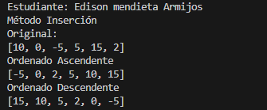
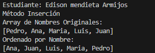
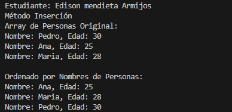
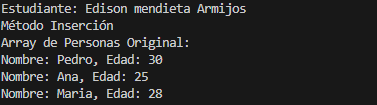
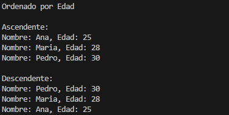

# Estructura de datos

**Estudiante** Edison Jahir Mendieta Armijos

## Metodos Ordenamiento

### Practica 1 - 20/OCTUBRE
Metodo Sort Bubble

### Practica 2 - 21/OCTUBRE
Metodo Sort Selecction en Java Y Python

Salida de Python 

Salida de Java

### Practica 3 - 23/OCTUBRE

**1. Arreglo de números enteros**

**2. Arreglo de cadenas (nombres)**

**3. Arreglo de personas ordenado por nombre**

**4. Arreglo de personas ordenado por edad**

